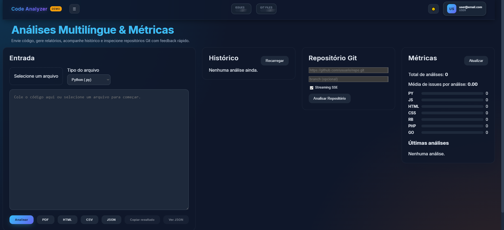

## Code Analyzer

> 🌐 Available languages: (PT-BR planned) · **English**

Full-stack TypeScript application that delivers lightweight multi-language code inspection, Git repository streaming analysis, historical metrics, and multi-format reporting.

> Prototype / portfolio-style project: heuristic analysis is intentionally simplified and not a replacement for full static analysis suites.

## 🔗 Demo & Preview
- **Live demo:** https://code-analyzer-t04x.onrender.com
- **Screenshot:**

  

## 🚀 Tech Stack
- **Frontend:** React 18 + Vite + TypeScript
- **Backend:** Node.js 18 + Express 4 + TypeScript
- **Testing:** Jest + Supertest (backend focus)
- **Reporting:** PDFKit, HTML templating, CSV & JSON serializers
- **Streaming:** Server-Sent Events (SSE) for Git analysis progress

## 🌐 Overview

The platform analyzes single code snippets or entire Git repositories, producing summarized sections of findings (issues, suggestions, stats). Authenticated users keep a history, export reports (PDF/HTML/CSV/JSON), and view aggregated metrics filtered by language or time period. Git repository analysis streams live progress and can be cancelled mid‑execution.

## ✨ Key Features

- Multi-language heuristics: JavaScript, Python, HTML, CSS (+ generic fallback for Ruby/PHP/Go)
- ESLint integration for JS code (in-memory run)
- Git repository shallow clone + concurrent file scanning + cancellable SSE stream
- Per-user analysis history with persisted summaries
- Export in four formats (PDF / HTML / CSV / JSON)
- Metrics endpoint with period and language filters
- JWT authentication + bcrypt hashing + rate limiting
- Modular analyzers layer (drop-in new language strategy)

## 🧩 Architecture

| Layer | How it works |
| ----- | ------------ |
| Backend (Express + TS) | REST API `/api/*`, SSE endpoints for streaming repo analysis, JWT auth, report generation. |
| Analyzers | Language-specific heuristic modules returning lightweight stats + issue lists. |
| Summary Builder | Normalizes analyzer outputs into uniform sections (id, severity, items). |
| Persistence | Prisma (MongoDB provider in current iteration) storing Users and Analyses. |
| Frontend SPA | React panels (Auth, Git, History, Metrics, Result) consuming API + EventSource. |
| Reporting | PDFKit + HTML/CSV/JSON generators mapping summary sections. |

### 🎨 UI & Tailwind

This project uses React + CSS (no Tailwind). The interface is split into focused panels:
- Auth / session management
- Code input + analyzer selection
- Git analysis panel (repo URL + branch + streaming log)
- Metrics dashboard (lines, issues, distribution by type)
- Results / export actions

Lightweight styling keeps dependency surface small; theming can be extended by adding a design token layer.

### 🔐 Unified Validation (Backend + Frontend)
- The frontend performs basic client-side checks; backend enforces core constraints (auth, size, supported file types).
- ESLint results merged only for JavaScript paths.
- A single summary shaping step (sections) keeps report/export formats consistent.

### 💾 Abstracted Persistence (Analysis Store)
- Prisma client wrapper (`store.ts`) persists analyses and builds aggregate metrics.
- Swapping databases involves adjusting `schema.prisma` and `DATABASE_URL` (Mongo used now; Postgres/SQLite feasible).
- Summaries stored in a compact JSON structure for fast retrieval.

### 📊 Observability & Logs
- Minimal console logging (can be upgraded to pino/winston).
- SSE stream events act as a real-time timeline (meta, progress, done, cancelled, error).
- Health endpoint `/health` for uptime probes.

The summary builder normalizes different analyzer outputs into a consistent schema consumed by exports and metrics.

| Frontend Panels | Responsibilities |
| --------------- | --------------- |
| AuthPanel | Login / demo session acquisition |
| GitPanel | Start/monitor/cancel repository analysis (SSE) |
| HistoryPanel | List prior analyses (id, file, issues) |
| MetricsDashboard | Aggregated metrics by filter (period/language) |
| ResultPanel | Display last analysis + export actions |

## 🗂 Folder Structure (summary)

```
backend/
  prisma/          # schema.prisma (Mongo provider) + dev/test dbs
  src/
    analyzers/     # Language heuristics (js, py, html, css, generic)
    report/        # PDF / HTML / CSV / JSON generators
    utils/         # gitAnalyzer, eslintRunner, summaryBuilder
    server.ts      # Express app + routes + SSE
    store.ts       # Persistence layer (users / analyses / metrics)
frontend/
  src/             # React components (panels) + api.ts
img/               # Print.PNG (screenshot)
scripts/           # copy-frontend-build.js (deploy bundling)
```

> Current persistence: MongoDB via Prisma (no migrations). Switching provider is straightforward by editing the schema.

## 🚀 Getting Started Locally

Prerequisite: [Node.js 18+](https://nodejs.org/)

```bash
git clone https://github.com/Hiidoko/Code-Analyzer.git
cd Code-Analyzer

# Backend deps
npm install --prefix backend

# Frontend deps
npm install --prefix frontend

# Environment (example)
cp backend/.env.example backend/.env
echo "JWT_SECRET=some-strong-secret" >> backend/.env

# Development (concurrent dev servers)
npm run dev

# Production (single service: backend serves built frontend)
npm run build
npm start
```

Dev: Backend http://localhost:4000 • Frontend http://localhost:5173

## 🔗 Core Endpoints

| Method | Route | Description |
| ------ | ----- | ----------- |
| POST | `/api/auth/register` | Create user |
| POST | `/api/auth/login` | Obtain JWT token |
| POST | `/api/auth/demo` | Demo user session (if enabled) |
| POST | `/api/analyze` | Analyze single code snippet |
| POST | `/api/report/pdf` | PDF export |
| POST | `/api/report/html` | HTML export |
| POST | `/api/report/json` | JSON export |
| POST | `/api/report/csv` | CSV export |
| GET | `/api/history` | List user analyses |
| GET | `/api/history/:id` | Fetch specific analysis |
| GET | `/api/metrics?period=7d&fileType=js` | Aggregated metrics |
| POST | `/api/git/analyze` | One-shot repo analysis |
| GET | `/api/git/analyze/stream` | Streaming repo analysis (SSE) |
| POST | `/api/git/analyze/cancel` | Cancel active streaming job |
| GET | `/health` | Health probe |

Sample analyze request:

```json
{
  "code": "function demo(){return 1}",
  "fileType": "js",
  "fileName": "demo.js"
}
```

Typical analyze response (simplified):

```json
{
  "fileType": "js",
  "result": { "lines": 12, "functions": 1, "eslintProblems": [] },
  "summary": {
    "generatedAt": "2025-10-06T10:00:00.000Z",
    "issuesCount": 2,
    "sections": [
      { "id": "js-basic", "title": "JS Heuristics", "severity": "info", "items": ["1 function detected"] }
    ]
  }
}
```

## 🤖 Chatbot Integration

Not applicable here. In this context, the analogous interactive flow is the Git repository streaming analysis:
- Client opens EventSource to `/api/git/analyze/stream`.
- Backend emits `meta` (id) then `progress` per processed file.
- On completion emits `done` with aggregated report or `cancelled` / `error`.
- Client can POST to `/api/git/analyze/cancel` with the `reqId` to abort.

## 🧠 Automatic Consultant Assignment

Replaced conceptually by the summary normalization pipeline:
1. Analyzer chosen based on `fileType`.
2. Raw metrics + heuristic findings collected.
3. (JavaScript only) ESLint runs and merges issues.
4. Sections built (id, title, severity, items) → unified shape.
5. Optional persistence + export.

## ♿ Accessibility & UX

Initial focus on a clean, panel-based layout. Accessibility improvements are incremental.

### Key Decisions
- Clear separation of panels (Git / Result / Metrics / History / Auth).
- Minimalistic form inputs with predictable labels.
- Streaming status uses plain text updates to remain screen-reader friendly.

### Keyboard Interactions
| Component | Keys | Result |
| --------- | ---- | ------ |
| Forms | Enter | Submit form |
| Panels | Tab / Shift+Tab | Navigate interactive elements |
| Streaming View | (Planned) Esc | Future cancellation shortcut |

### ARIA / Semantics Used
| Feature | Purpose |
| ------- | ------- |
| `role="status"` (planned) | Non-intrusive live streaming feedback |
| Landmark regions | Aid navigation (future enhancement) |

### Focus Management
- Auth success returns focus to main interaction panel.
- Stream completion triggers result panel display.

### Accessibility Backlog
- Add focus outlines & skip link.
- Add live region for streaming progress.
- Dark/high-contrast mode.
- Automated a11y audits (axe / pa11y) in CI.

> Goal: keep interface lightweight while remaining extensible for future accessibility passes.

## 🔄 Future Enhancements
- Deeper Python/security linters (flake8/pylint/bandit integration)
- Incremental repo cache + diff-based re-analysis
- Postgres option with richer aggregations
- Async queued heavy report generation
- Trend / regression alerts
- Role-based access & audit events

## 🧪 Testing & Quality

- Jest + Supertest cover critical API flows and analyzer logic.
- ESLint enforces code style (TypeScript aware).
- Build excludes test files in production bundle.

Useful scripts:

```
npm --prefix backend run test      # run tests
npm --prefix backend run lint      # lint backend
```

Current coverage: authentication, analyzer heuristics, basic git logic (unit-level), reporting utilities (selected paths).

### Technical Backlog
- Add end-to-end tests (Playwright) for full Git streaming flow.
- Performance profiling of large repositories.
- Add structured logger (pino) + correlation ids.

## ⚠️ Disclaimer
Heuristic, educational-style platform. Do not rely on it for security or exhaustive static analysis. Add hardening (threat model, audits, logging, MFA, RBAC) before any production context.

## 📄 License
Released under the **ISC** License. See `LICENSE` for details.

## 🙌 Credits
Created by **Caio Marques (Hiidoko)**  
[LinkedIn](https://linkedin.com/in/hiidoko)

If this project helped you, drop a ⭐ and feel free to adapt.


