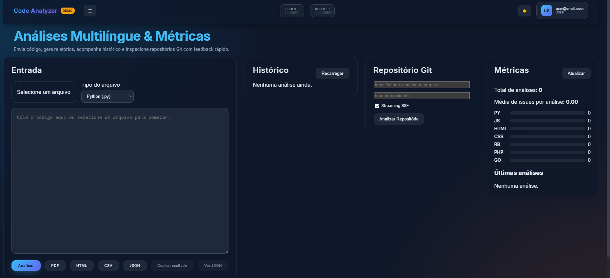

## Code Analyzer

> 🌐 Read in: **Português (BR)** · [Português (BR)](./README.md)

> Unified interface to quickly inspect multi-language code, stream Git repository analysis, and generate exportable reports.

**Live demo:** https://code-analyzer-t04x.onrender.com  
**Screenshot:**



> Work in progress. Heuristics are intentionally lightweight (not a replacement for SonarQube, full ESLint setups, or Bandit).

## 🚀 Tech Stack
- **Frontend:** React 18 + Vite + TypeScript
- **Backend:** Node.js 18 + Express 4 + TypeScript
- **Persistence:** Prisma (currently using MongoDB via `DATABASE_URL`)
- **Streaming:** Server-Sent Events (SSE) for Git analysis progress
- **Reporting:** PDFKit + HTML / CSV / JSON generators
- **Auth & Security:** JWT, bcrypt, basic rate limiting, configurable CORS
- **Testing:** Jest + Supertest (backend focused)

## 🌐 Overview
Users can:
1. Paste code and get an immediate heuristic analysis.
2. Provide a Git repository URL and watch real-time progress (SSE).
3. Keep an authenticated history of analyses and query aggregated metrics.
4. Export results as PDF, HTML, CSV or JSON.

All analyzer outputs are normalized into unified "sections" (id, title, severity, items) reused across UI, metrics, and report exporters.

## ✨ Key Features
- Supported languages: JavaScript, Python, HTML, CSS (+ generic fallback for Ruby/PHP/Go)
- In-memory ESLint integration for JavaScript
- Shallow clone + concurrent repository scan (cancellable)
- Per-user history + metrics filtered by period / language
- Multi-format export (PDF / HTML / CSV / JSON)
- JWT auth + optional demo user
- Modular architecture for easily adding new analyzers

## 🧩 Architecture
| Layer | Role |
| ----- | ---- |
| Backend (Express + TS) | REST routes, SSE, auth, report generation |
| Analyzers | Language heuristics + basic statistics enrichment |
| Summary Builder | Converts raw analyzer output into uniform sections |
| Persistence (Prisma) | Users & Analyses (MongoDB in current iteration) |
| Frontend (React) | Panels: Auth, Git, Metrics, History, Result |
| Reporting | PDFKit + HTML/CSV/JSON serializers |

### Analysis Pipeline
1. Receive code + `fileType`.
2. Execute language-specific heuristic.
3. (JS) Merge ESLint diagnostics.
4. Normalize into sections (issues, stats, hints).
5. (Optional) Persist for history / metrics.

### Git Repository Streaming
- SSE endpoint: `/api/git/analyze/stream?repoUrl=...&token=...`
- Events: `meta` → multiple `progress` → `done` | `cancelled` | `error`
- Cancellation via `POST /api/git/analyze/cancel` (with `reqId`).

## 🗂 Structure (Summary)
```
backend/
  prisma/          # schema.prisma (Mongo) + local dev/test dbs
  src/
    analyzers/     # Language heuristics
    report/        # PDF / HTML / CSV / JSON generators
    utils/         # gitAnalyzer, eslintRunner, summaryBuilder
    server.ts      # Routes, SSE, middlewares
    store.ts       # Persistence & aggregation
frontend/
  src/             # React components and api.ts
img/               # Print screenshot
scripts/           # copy-frontend-build.js
```

## 🚀 Getting Started
Requirements: Node 18+, git, (optional) MongoDB / Atlas instance.

```bash
git clone https://github.com/Hiidoko/Code-Analyzer.git
cd Code-Analyzer

# Install dependencies
npm install --prefix backend
npm install --prefix frontend

# Environment variables
cp backend/.env.example backend/.env
echo "JWT_SECRET=a-strong-secret" >> backend/.env

# Development (frontend + backend)
npm run dev

# Production (single service: backend serves built frontend)
npm run build
npm start
```

Dev: Backend http://localhost:4000 • Frontend http://localhost:5173

### Core Environment Variables
| Name | Description |
| ---- | ----------- |
| `DATABASE_URL` | Prisma connection (Mongo/Postgres/etc.) |
| `JWT_SECRET` | Token signing secret |
| `BCRYPT_ROUNDS` | Hash cost (default 12) |
| `DISABLE_DEFAULT_DEMO` | Skip demo user creation |
| `DISABLE_DEFAULT_ADMIN` | Skip default admin creation |
| `RATE_LIMIT_*` | Rate limit window / max configuration |
| `CORS_ORIGINS` | Comma-separated allowed origins (blank = allow in dev) |

## 🔗 Core Endpoints
| Method | Route | Description |
| ------ | ----- | ----------- |
| POST | `/api/auth/register` | Create user |
| POST | `/api/auth/login` | Authenticate (JWT) |
| POST | `/api/auth/demo` | Demo session (if enabled) |
| POST | `/api/analyze` | Analyze single code snippet |
| POST | `/api/report/pdf|html|json|csv` | Export report |
| GET | `/api/history` | List user's analyses |
| GET | `/api/history/:id` | Analysis detail |
| GET | `/api/metrics` | Aggregated metrics (query: `period`, `fileType`) |
| POST | `/api/git/analyze` | Quick repo analysis (non-stream) |
| GET | `/api/git/analyze/stream` | Streaming SSE repo analysis |
| POST | `/api/git/analyze/cancel` | Cancel active process |
| GET | `/health` | Health check |

Example analyze request:
```json
{
  "code": "def add(a,b):\n    return a+b",
  "fileType": "py",
  "fileName": "add.py"
}
```

Simplified response:
```json
{
  "fileType": "py",
  "result": { "lines": 2, "functions": 1 },
  "summary": {
    "generatedAt": "2025-10-06T12:00:00.000Z",
    "issuesCount": 0,
    "sections": [ { "id": "py-basic", "title": "Python Basic", "severity": "info", "items": ["1 function detected"] } ]
  }
}
```

## 🔐 Security (Current)
- JWT (12h expiration)
- bcrypt password hashing
- Basic rate limiting (auth + API)
- Configurable CORS
> Recommended before production: MFA, structured logging, audit trail, key rotation, granular RBAC.

## 📤 Export Formats
| Format | Purpose |
| ------ | ------- |
| PDF | Human-readable snapshot |
| HTML | Rich offline view |
| CSV | Spreadsheets / lightweight BI |
| JSON | Integrations / pipelines |

## 🧪 Testing & Quality
| Area | Status |
| ---- | ------ |
| Auth | Integration covered |
| Analyzers | Partial heuristic coverage |
| Git (stream) | Basic unit coverage (expand) |
| Exports | Partial tests (HTML/JSON) |

Run tests:
```bash
npm --prefix backend run test
```

## 🛣️ Roadmap
- Security / Python linters (bandit, semgrep) & deeper analysis
- Postgres backend with analytical aggregations
- Incremental repo cache + diff-based re-run
- Async generation for heavy reports
- Metric regression alerts
- Structured logger (pino) + correlation IDs
- End-to-end tests (Playwright) for streaming flow

## FAQ
**Can I add another language?** Create a new file in `analyzers/` and register it.  
**Why simple heuristics?** Focus on speed + architectural clarity.  
**Split frontend & backend?** Yes—serve `frontend/dist` separately and change the base URL in `api.ts`.  
**Production ready?** Only after hardening (security, observability, scalability).  

## ⚠️ Disclaimer
Illustrative/heuristic tool; not a complete static analysis or security product without further hardening.

## 📄 License
MIT License. See `LICENSE`.

## 🙌 Credits
Created by **Caio Marques (Hiidoko)**  
[LinkedIn](https://linkedin.com/in/hiidoko)

If this project helped you, leave a ⭐.

---
<p align="center">Code Analyzer — metrics, insights and reports in a simple flow. ⚡</p>
